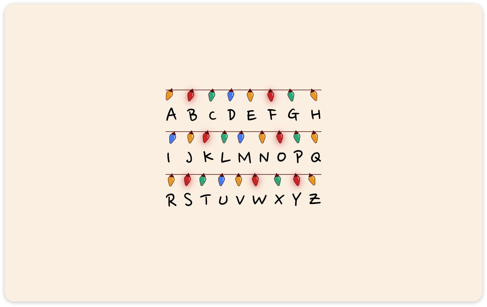

# Comunicação do Will

Página desenvolvida utilizando HTML e CSS fazendo referência a série Stranger Things da Netflix. Nela o personagem Will desaparece misteriosamente da pequena cidade de Hawkins. Após um tempo o garoto começa a se comunicar com sua família através das luzes, sua mãe escreve o alfabeto em baixo das luzes de natal para conseguir se comunicar com seu filho.



## Tecnologias:
- [HTML5](https://developer.mozilla.org/pt-BR/docs/Web/HTML)
- [CSS3](https://developer.mozilla.org/pt-BR/docs/Web/CSS)

## Como executar? 
O projeto está disponível [aqui](https://will-communication-st.vercel.app/).

Caso deseje ver o código fonte do projeto em sua máquina, abra o terminal e execute o seguinte comando para clonar o projeto:
```sh
git clone https://github.com/mlucianaap/will-communication-st.git
```

Navegue até o diretório gerado após clonar o projeto. 

Prontinho ;)